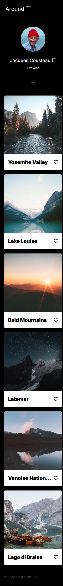

# Project 3: Around The U.S.

## Overview

This project is a responsive webpage built as part of a web development course. The goal of the project is to create a visually appealing and functional design that adapts seamlessly to different screen sizes, including desktop, tablet, and mobile devices. The project demonstrates the use of modern CSS techniques such as Flexbox, Grid, and media queries to achieve responsiveness.

## Features

- **Responsive Design**: The layout adjusts dynamically to popular screen sizes, including 320px (mobile), 768px (tablet), and 1280px (desktop).
- **BEM Methodology**: The project follows the Block-Element-Modifier (BEM) naming convention for clean and maintainable CSS.
- **CSS Grid and Flexbox**: Used for creating flexible and responsive layouts.
- **Custom Fonts**: Includes the "Inter" font family for a modern and clean look.
- **Optimized Images**: Images are exported from Figma and optimized for faster loading.

## Technologies Used

- **HTML5**: For semantic structure and accessibility.
- **CSS3**: For styling and responsive design.
- **Normalize.css**: To ensure consistent styling across browsers.
- **Figma**: For design reference and asset export.

## File Structure

The project follows a modular file structure for better organization.

## How to Run the Project

1. Clone the repository to your local machine:
   ```bash
   git clone <repository-url>
   ```
2. Open the index.html file in your browser to view the project.

## Design Reference

The design for this project is based on a Figma prototype:

- [Figma Design Link](https://www.figma.com/design/Es8zZP3ARGH9JGcw60i3OD/Sprint-3_-Around-the-US?node-id=7505-2&t=KeRLLNgbMsK5zBZR-0)

## Screenshots

### Desktop View (1280px)


### Mobile View (320px)



## Future Improvements

- Add JavaScript functionality for interactive elements (e.g., like buttons).
- Implement accessibility features such as ARIA roles and keyboard navigation.
- Optimize further for performance and SEO.

## Author

**J. David Mena**
This project was created as part of the TripleTen web development course.

## link to the project on GitHub Pages

[https://j-david-mena.github.io/se_project_aroundtheus/]

## link to YouTube video

[https://youtu.be/b2DsyIXbNTA]
